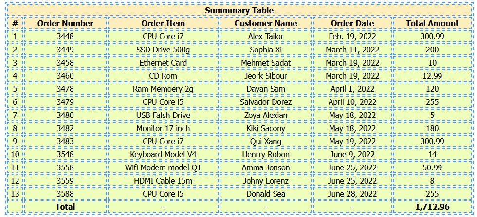

[](https://pepy.tech/project/django-query-to-table)

### django-query-to-table (DjangoQtt) is an easy to use django package to generate html table from django queryset or sql query.

You can read more about this package here : [django query to table package](https://mshaeri.com/blog/generate-html-table-report-from-sql-query-in-django/)

The package has two functions, named:
- **generate_from_sql**: Generate HTML table by given SQL query
- **generate_from_queryset**:Generate HTML table by given Django queryset

Parameters and options:

* title : The title of the report that will be shown on top of table
* sqltext/queryset : The sql select query to retrieve data / django queryset
* footerCols : A list of columns name that you want to have Sum of values on footer . Example : ['amount','price']
* htmlClass : Html CSS classes for the table
* direction (default = "ltr") : Indicates direction of the report page.  "ltr"- Left to Right , "rtl" -  Right to Left
* font (default = "Tahoma") : Font of title and table contents
* totalText (default = "Total") : Title of footer row that will be the put below the first column.
* rowIndex (default = False) : Indicates whether the table should have index column or not.
* headerRowColor (default = '#eeeeee') :  The header (title) row background color.
* evenRowColor (default = '#ffffff') :  The even rows background color.
* oddRowColor (default = '#ffffff') :  The odd rows background color.


## Installation
Run following command to install DjangoQtt :

```shell
pip install django-query-to-table
```

## Example usage :

- Generate HTML table by SQL query:

```python
from django_query_to_table import DjangoQtt
from django.http import HttpResponse

# view function in Django project
def listOfPersons(request):
  reportTitle = "Employee List"
  sqlQuery = "SELECT FirstName as 'First Name', LastName as 'Last Name', phone as 'Phone Number', salary as 'Salary' FROM persons"
  columnsToBeSummarized = ['Salary']
  fontName = "Arial"
  cssClasses = "reportTable container"
  headerRowBackgroundColor = '#ffeeee'
  evenRowsBackgroundColor = '#ffeeff'
  oddRowsBackgroundColor = '#ffffff'
  rowIndexVisibility = True
  table = DjangoQtt.generate_from_sql(reportTitle, sqlQuery, columnsToBeSummarized, cssClasses,
                                  "ltr", fontName, "Total Salary", rowIndexVisibility,
                                  headerRowBackgroundColor, evenRowsBackgroundColor, oddRowsBackgroundColor
                                  )
  
  # here the table is a string variable containing the html table showing the query result
  return HttpResponse(table)
   
 ```

- Generate HTML table from querset:

> Since Django 4.0.4 introduced a security fix that disallows spaces in aliases, you can use double underscores (__) as a substitute in your aliases. The table generator will automatically display them as spaces in the output. Here's an example:


```python
from django_query_to_table import DjangoQtt
from django.http import HttpResponse
from .models import Order
# view function in Django project
def listOfPersons(request):

  order_queryset = Order.objects.annotate(
      **{
         'Order__Number': F('order_number'),
         'Order__Item': F('order_item'),
         'Customer__Name': F('customer_name'),
         'Order__Date': F('order_date'),
         'Total__Amount': F('total_amount'),
      }
   ).values(
      'Order__Number',
      'Order__Item',
      'Customer__Name',
      'Order__Date',
      'Total__Amount'
   )

  table = DjangoQtt.generate_from_queryset(
                                       title = "Summmary Table",
                                       queryset = order_queryset,
                                       htmlClass = "summary",
                                       rowIndex = True,
                                       footerCols=['Total__Amount'],

                                    )
  
  return HttpResponse(table)
   
 ```

 The table will be look like this:

  


If you find this package useful, please consider giving it a star! ⭐ It helps support the project and lets others discover it.
